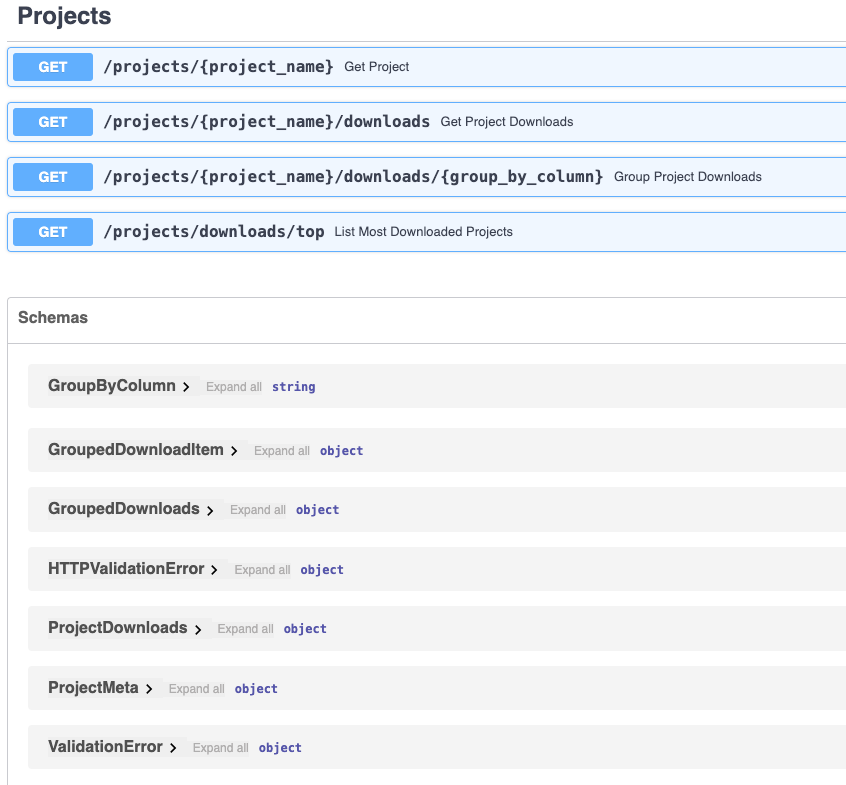
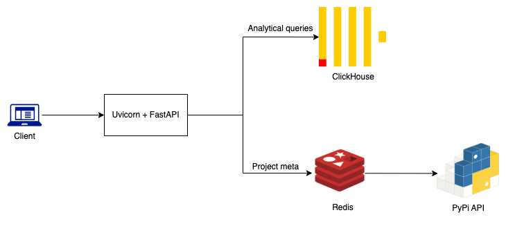

# PyPI ClickHouse Analytics

📊 **PyPI ClickHouse Analytics** is a FastAPI application that analyzes and serves PyPI download data using ClickHouse. 
On startup, it automatically initializes the database and loads PyPI dataset (1.6M records) directly from a public S3 bucket.

---

## 🚀 Features

- ⚡ Fast SQL queries powered by ClickHouse
- 🌐 REST API served via FastAPI
- ⚡ 3rd party responses (PyPi API) are cached in Redis
- 🐳 Docker + Poetry powered development
- 🔄 Automatic ClickHouse initialization and table creation

If you're curious about how I implemented this, check out [my series of posts](https://medium.com/@alexeyfurmenkov/building-fastapi-clickhouse-analytics-service-part-1-intro-afede148ef89) on Medium.

## 📦 How to run the app?
```
git clone https://github.com/alexfurmenkov/pypi-clickhouse-analytics.git
cd pypi-clickhouse-analytics
docker-compose up
```

## 📦 API endpoints and schema
* Get project metadata
* Count Project downloads
* Group Project downloads by country or Python version
* List most downloaded projects

Head to `/docs` to see the Swagger doc:




## Architecture
* Analytical queries - Clickhouse
* Caching - Redis or local LRU cache
* Project metadata - PyPi API



## Local development
The project is managed with poetry, run `poetry install` to install and configure all necessary dependencies. 
Then, run `uvicorn pypi_clickhouse_analytics.main:app --reload` to start the app, you should see an output like:
```
INFO:     Started server process [40443]
INFO:     Waiting for application startup.
INFO:     Application startup complete.
INFO:     Uvicorn running on http://127.0.0.1:8000 (Press CTRL+C to quit)
```

## Configuration
The app manages config like DB URL, cache TTL etc. using [pydantic-settings](https://pypi.org/project/pydantic-settings/).
The config is defined in `src/pypi_clickhouse_analytics/app_settings.py`. Each setting in the `Settings` class can be overridden with environment variables (.env file for example).